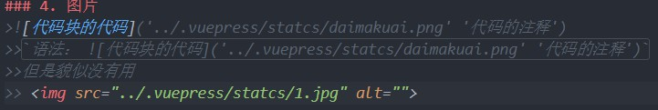

## MARKDOWN 基础语法

### 1.标题
>`### 标题 （1-6个'#'对应h1-h6），当前相当于h3`

### 2.字体
>**加粗**
>>`语法：**加粗**`

>*斜体*
>>`语法：*斜体*`

>***加粗斜体***
>>`语法：***加粗斜体***`

>~~删除线~~
>>`语法：~~删除线~~`

### 3. 代码块
>单行代码( `` 包裹, 两个反引号 )
>>`console.log(1)`

>多行代码 （三个 ` 包裹）
>>```js
>>    function fn () {
>>        console.log('fn')
>>    }
>>```

### 4. 图片
>`1.语法： `
>
>
>***
>`2.语法： `
>
>
> ***
>`3.语法： `
>
>

### 5. 分割线
>```text
>    ---
>    ---
>
>    ***
>    ***
>    
>    注： -和*都是分割线，看起来貌似没啥区别
>```
>>---
>>---
>>***
>>***


### 6. 表格
>```
>表格格式：
>
>    |姓名|年龄|性别|
>    |:--|:--:|--:|
>    |左对齐|居中显示|右对齐|
>
>
>    注： ":"在哪边就是咋对齐，两边都有就是居中
>```
>>姓名|年龄|性别
>>:--|:--:|--:
>>左对齐|居中显示|右对齐

### 7. 有序/无序列表
>```
>1. 效果如下 - + *（序号内容必须有空格，上下级要有缩进）
>   1. 下级 
> 
>无序列表：（嵌套加tab即可）
>+ 无序1 （数字即有序列表）
>   + 无序2 （无序列表用 - + * 任何一种都可以）
>```
>>1. 效果如下 - + *（序号内容必须有空格，上下级要有缩进）
>>   1. 下级 
>>
>>无序列表：（嵌套加tab即可）
>>+ 无序1 （数字即有序列表）
>>  + 无序2 （无序列表用 - + * 任何一种都可以）

### 8. 引用
>```
>   一个> 引用
>   两个>> 二级引用
>```

>引用
>>二级引用

### 9. tip
>```
>语法：
>:::tip 提示
>内容
>:::
>
>:::warning 警告
>内容
>:::
>
>:::danger 错误
>内容
>:::
>```
>:::tip 提示
>内容
>:::